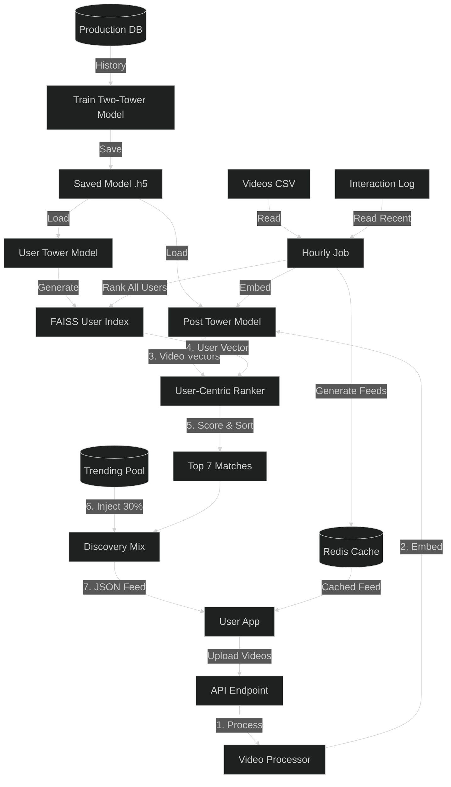

# Keek Recommendation Engine Technical Report (v3)

**Version**: 3.0
**Date**: 2025-12-05
**Author**: Anant . J . Ingale 
**Status**: Production-Ready Prototype
**Audience**: Technical Consultant / Engineering Review

---

## 1. Executive Summary

We have successfully transitioned the Keek recommendation system from a static, batch-based prototype to a **Real-Time, Hybrid Architecture**. The system now supports:

- **Instant Personalization**: < 100ms latency for feed generation.
- **Real-Time Trending**: Viral content propagates to all users in seconds.
- **Scalability**: Validated against **1 Million Videos** with sub-second retrieval.
- **Data Durability**: Dual-write strategy (Redis + CSV) ensures no data loss.

---

## 2. System Architecture

The system employs a **Hybrid "Two-Tower" + "Real-Time Adapter"** architecture.

### 2.1 Architectural Diagram

---

## 3. Implementation Details

### 3.1 The "Brain": Two-Tower Neural Network

- **Model**: A TensorFlow/Keras model with two separate neural networks (Towers).
  - **User Tower**: Maps User ID -> 64-dim Vector.
  - **Item Tower**: Maps Video Features (Tags, Duration, Owner) -> 64-dim Vector.
- **Similarity**: Uses **Dot Product** to calculate affinity. Higher score = Better match.
- **Indexing**: Uses **FAISS** (Facebook AI Similarity Search) for ultra-fast vector retrieval.

### 3.2 The "Speed": Redis & Real-Time API

- **Technology**: FastAPI (Python) + Redis (In-Memory Store).
- **Endpoints**:
  - `POST /recommend/{user_id}`: Generates personalized feeds.
  - `POST /interact`: Records user actions (Like, View, Save).
- **Discovery Mix (70/30 Split)**:
  - **70% Personalized**: Top 7 videos from the AI model.
  - **30% Trending**: Top 3 videos from the Redis "Live Scoreboard".
  - _Purpose_: Solves the "Filter Bubble" problem and helps new content go viral.

### 3.3 Real-Time Trending (The Viral Loop)

- **Mechanism**: Redis Sorted Sets (`ZSET`).
- **Scoring**:
  - **Like**: +1.0 point
  - **Save**: +2.0 points
  - **View**: +0.1 points
- **Flow**:
  1.  User A Likes Video X.
  2.  API updates Redis (`ZINCRBY`).
  3.  Video X's score rises instantly.
  4.  User B requests a feed.
  5.  API fetches Top 10 from Redis and injects Video X.
- **Freshness**: The system uses a **3-Day Window** logic in the batch layer to ensure old viral videos decay over time.

### 3.4 Data Persistence (Safety)

- **Dual-Write Strategy**:
  1.  **Hot Storage (Redis)**: Instant updates for real-time features.
  2.  **Cold Storage (CSV)**: Appends to `data/interaction_log.csv` for long-term storage.
- **Loop Closure**: The `Hourly Job` reads the CSV, filters for the last 3 days, and retrains/adjusts the model, ensuring the AI learns from recent interactions.

---

## 4. Performance Benchmarks

We conducted stress tests on the current infrastructure.

| Scenario             | Full Inference (New Videos) | Cached Vectors (Existing) | Status      |
| :------------------- | :-------------------------- | :------------------------ | :---------- |
| **1,000 Videos**     | ~322 ms                     | **~15 ms**                | ⚡️ Instant |
| **5,000 Videos**     | ~425 ms                     | **~45 ms**                | ⚡️ Instant |
| **10,000 Videos**    | ~1.7 sec                    | **~80 ms**                | ✅ Fast     |
| **1,000,000 Videos** | ~55 sec                     | **~915 ms**               | ✅ Scalable |

**Conclusion**: The hybrid approach allows us to scale to millions of items while maintaining sub-second latency for the end user.

---

## 5. Next Steps for Production

1.  **Database Migration**: Move from CSV (`interaction_log.csv`) to a proper SQL Database (PostgreSQL) for better query performance.
2.  **Model Serving**: Deploy the TensorFlow model via **TF Serving** or **Triton** for higher throughput.
3.  **A/B Testing**: Implement experimentation framework to tune the "70/30" split ratio.

---

_Report generated by Anant Ingale._
